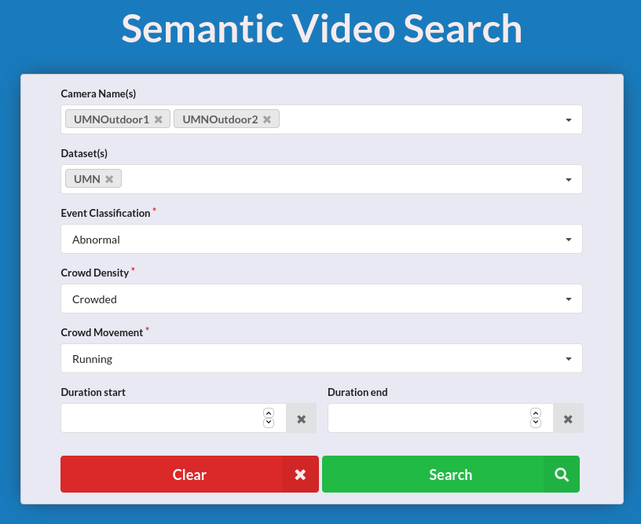
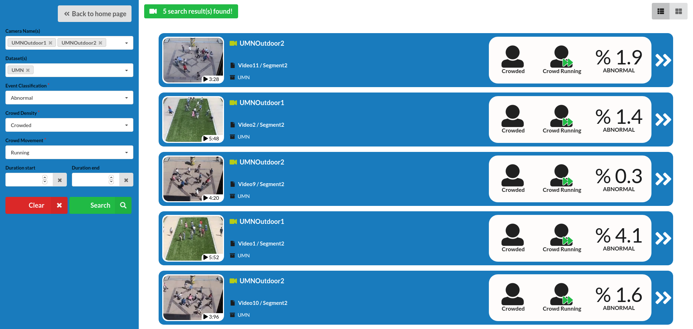
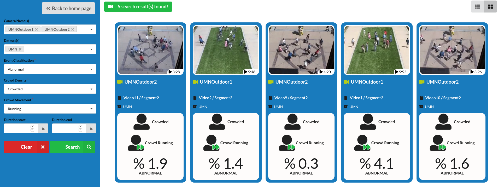
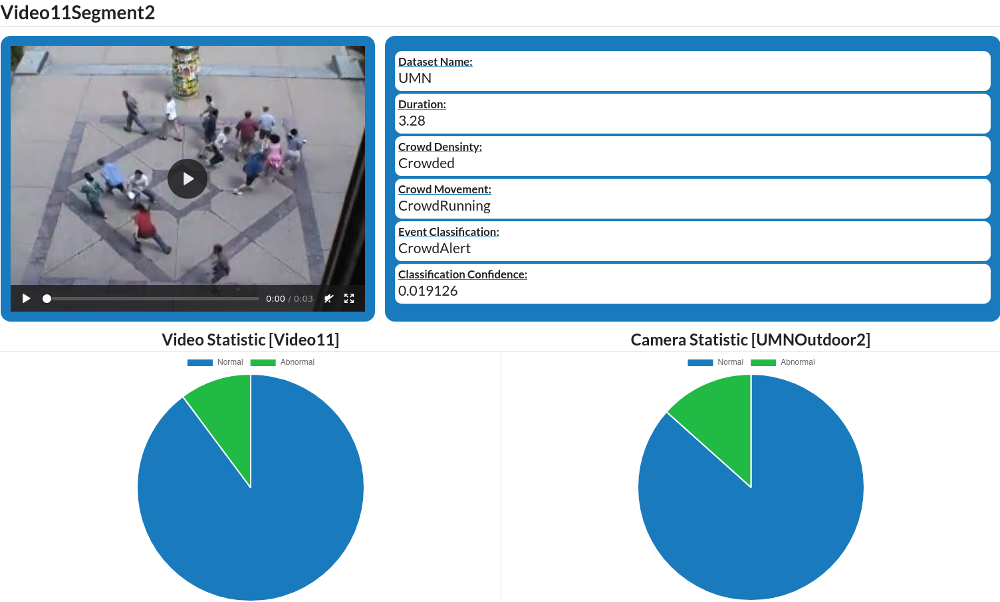
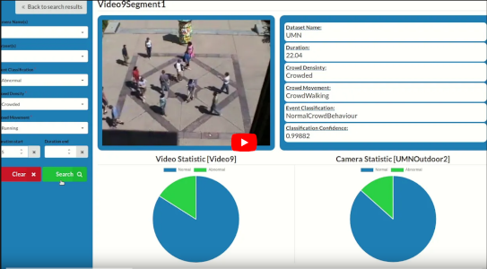
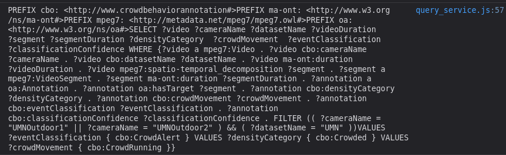

# Semantic Video Search Interface
[](https://doi.org/10.1007/s11042-020-08659-2)
> This project is part of the academic research. The paper was published in the
> Multimedia Tools and Applications issue 79 published by Springer.

**IMPORTANT: If you use the provided code, you should cite our paper as follows:**

> Hatirnaz, E., Sah, M. & Direkoglu, C. A novel framework and concept-based
> semantic search Interface for abnormal crowd behaviour analysis in surveillance
> videos. Multimed Tools Appl 79, 17579–17617 (2020).
> https://doi.org/10.1007/s11042-020-08659-2

A SPA (single-page application) web interface that provides detailed video search
to users in abnormal/normal crowd videos. It shows pie charts of what percentage
of the video or camera is abnormal/normal on the video details page. Also this is
my graduation thesis project. **This is just a PoC (Proof-of-Concept) project for
the research, _don't use it in the production environment!_**

Major technolojies/frameworks/tools I used this project are:

* [JavaScript](https://en.wikipedia.org/wiki/JavaScript) /
  [NodeJS](https://nodejs.org/en/) / [npm](https://www.npmjs.com/)
  - [VueJS](https://vuejs.org/) / [Vue-Router](https://router.vuejs.org/)
  - [Chart.js](https://www.chartjs.org/)
  - [JQuery](https://jquery.com/)
  - [Webpack](https://webpack.js.org/)
  - [Eslint](https://eslint.org/)
* [Semantic UI CSS Framework](https://semantic-ui.com/)
* [Apache Jena Fuseki](https://jena.apache.org/documentation/fuseki2/)
* [RDF](https://en.wikipedia.org/wiki/Resource_Description_Framework) /
  [SPARQL](https://en.wikipedia.org/wiki/SPARQL)
* [Docker](https://www.docker.com/)
* [Hecate](https://github.com/yahoo/hecate): for generate animated video
  summaries
* [Python 2.x or 3.x](http://python.org/)

## Motivation
The motivation of this project came from [Assoc. Prof. Dr. Melike Şah
Direkoğlu](http://staff.neu.edu.tr/melike.sah/), a lecturer at Near East
University. She asked me to participate in this research project, as I was an
active student in her lectures. My role in this research project is to develop a
semantic search user interface and after doing user experiments to show the
difference between keyword-based search methods and semantic video search.
Initially, I was not directly interested in Image Processing and Semantic Web,
instead, developing web interfaces was more exciting for me. However, over time,
this research study increased my interest in these fields. If I were to pursue my
career academically, I would prefer to work in these fields.

## Usage
### 1. Running Jena Fuseki Server
#### 1.1. Docker on GNU/Linux Distros
First of all, you need to install Docker on your machine. For my distro (Ubuntu
20.04.02 LTS), I follow [these
instructions](https://docs.docker.com/engine/install/ubuntu/) to install Docker
on my machine.

Then run following commands to get Jena Fuseki docker image and create the running
container:
```console
$ docker pull stain/jena-fuseki
$ docker run -d --name fuseki1 -p 3030:3030 -e TDB=2 stain/jena-fuseki
```

Now Apache Jena Fuseki is serving at **localhost:3030**

**TIP:** Run `docker logs fuseki1 | grep 'admin='` command to get the randomly
generated admin password.

For more information about Apache Jena Fuseki docker image, see [Docker Hub
page](https://hub.docker.com/r/stain/jena-fuseki).

#### 1.2. Standalone JAR binary on Windows
First of all, you need to install latest version of [JRE (Java Runtime
Environment)](https://java.com/) on your machine. Then download [Apache Jena
Fuseki binaries](https://jena.apache.org/download/index.cgi) and extract
compressed files to the folder. Then finally run the `fuseki-start.bat` file.

### 2. Load RDF documents on Jena Fuseki:
1. Open **localhost:3030** in your browser.
2. Login as the username '**admin**' and the password you got from the `docker
   log` command earlier.
   * **On Windows**, this step isn't required.
3. Go to **manage datasets** page.
4. Switch to **add new dataset** tab.
5. Fill in the fields as follows: \
   Dataset name: ***videos*** \
   Dataset type: ***In-memory***
6. **Create dataset**.
7. Click the **upload data** button.
8. Click the **select files...** button and select all **.ttl** files in
   **rdf-data** directory in this repository.
9. Then finally click the **upload all** button.

If all progress bar colors are green, this means that all RDF documents have been
loaded successfully to the Jena Fuseki database. Now, you can switch **query**
tab and run any SPARQL queries you want.

**IMPORTANT:** See "References" section for using our RDF data and the ontology.

### 3. Set up web application
Copy all video files into the `./static/videos/` directory. The summary videos of
the real videos generated by the Hecate, should end with file names '`_sum.mp4`'.

Example directory structure:

```txt
static/
└── videos
    ├── Video1.mp4
    ├── Video1Segment1.mp4
    ├── Video1Segment1_sum.mp4
    ├── Video1Segment2.mp4
    ├── Video1Segment2_sum.mp4
    ├── Video1_sum.mp4
    ├── Video2.mp4
    ├── Video2Segment1.mp4
    ├── Video2Segment1_sum.mp4
    ├── Video2Segment2.mp4
    ├── Video2Segment2_sum.mp4
    ├── Video2Segment3.mp4
    ├── Video2Segment3_sum.mp4
    ├── Video2_sum.mp4
    ...
```

**NOTE:** Unfortunetely we can't share the video files we use in the research.
But you can find the full video file (not seperated video parts by activity
types) on the University of Minnesota's [Monitoring Human
Activity](http://mha.cs.umn.edu/) page (see "_Detection of Unusual Crowd
Activity_" title in the "_Detection Events_" section).

### 4. Build web application
**Requirement for building web application:**
* [NodeJS](https://nodejs.org/en/)
* [npm](https://www.npmjs.com/) or [yarn](https://yarnpkg.com/)

**For npm users:**
```console
$ cd semantic-video-search
$ npm install
$ npm run build
```
**For yarn users:**
```console
$ cd semantic-video-search
$ yarn
$ yarn run build
```

The output of the latest command should contain "Build complete" message for the
next step.

Additionally,  you can start up development server with following command:
```console
$ npm run dev # npm users
$ yarn run dev # yarn users
```

### 5. Serve web application
```console
$ cd dist/
$ python -m SimpleHTTPServer 8080 # requires python 2.x
$ python3 -m http.server 8080 # requires python 3.x
```

The semantic video search user interface is now serving at **localhost:8080**.
## Screenshots / Demonstration





**Demonstration video available on YouTube**

[](https://youtu.be/8f4UVgYBmHs)

## Throubleshooting (Debugging)
You can enable Debug mode to see generated SPARQL queries from `QueryService`
class. To do this, follow these steps:

1. Open the `./src/components/SearchBox.vue` file.
2. Go to the **line 169**.
3. Replace the line like this:
   ```diff
   -        const searchService = new SearchService()
   +        const searchService = new SearchService(true)
   ```

Now you can see generated SPARQL queries in your browsers' developer tools
console.



Additionally, for debug Vue components, you can install [Vue.js
devtools](https://github.com/vuejs/vue-devtools) extension to your browser.

* [Chrome extention](https://chrome.google.com/webstore/detail/vuejs-devtools/nhdogjmejiglipccpnnnanhbledajbpd)
* [Firefox extension](https://addons.mozilla.org/en-US/firefox/addon/vue-js-devtools/)

## Known Issues
### Restarting Fuseki container causes the fuseki server to return 'Http Error 503'
Creating a docker volume and change the dataset type might fix this issue, but
I'm not sure. I used following commands to remove and re-create the container
(these commands will delete all rdf documents loaded on the fuseki server).

```console
$ docker kill fuseki1
$ docker rm fuseki1
$ docker run -d --name fuseki1 -p 3030:3030 -e TDB=2 stain/jena-fuseki
```

If you know more usefull and right way to resolve this issue, please send me Pull
Request. I will be glad for your help!

## Authors
* ***Assoc. Prof. Dr. Melike Şah DİREKOĞLU*** at Near East University |
  [Homepage](http://staff.neu.edu.tr/melike.sah/) |
  [Google Scholar Profile](https://scholar.google.com/citations?user=hTwUPQcAAAAJ&hl=en&oi=sra) |
  [Email (for academic purposes)](mailto:melike.sah@neu.edu.tr)
* ***Asst. Prof. Dr. Cem DİREKOĞLU*** at Middle East Technical University Northern Cyprus Campus |
  [Homepage](http://users.metu.edu.tr/cemdir/) |
  [Google Scholar Profile](https://scholar.google.com/citations?user=DMIUAvgAAAAJ&hl=en&oi=sra) |
  [Email (for academic purposes)](mailto:cemdir@metu.edu.tr)
* ***Computer Engineer Eren Hatırnaz*** |
  [Homepage](https://erenhatirnaz.github.io) |
  [Email](mailto:erenhatirnaz@hotmail.com.tr)

## References
* **If you use the provided RDF metadata, you should cite the following two
  papers as follows:**

  > Hatirnaz, E., Sah, M. & Direkoglu, C. A novel framework and concept-based
  > semantic search Interface for abnormal crowd behaviour analysis in
  > surveillance videos. Multimed Tools Appl 79, 17579–17617 (2020).
  > https://doi.org/10.1007/s11042-020-08659-2

  > M. Sah and C. Direkoglu, "Semantic annotation of surveillance videos for
  > abnormal crowd behaviour search and analysis," 2017 14th IEEE International
  > Conference on Advanced Video and Signal Based Surveillance (AVSS), Lecce, 2017,
  > pp. 1-6, DOI: 10.1109/AVSS.2017.8078537.

* **If you use the code for visualizing the abnormal video content,  you should
  cite the following two papers as follows:**

  > Hatirnaz, E., Sah, M. & Direkoglu, C. A novel framework and concept-based
  > semantic search Interface for abnormal crowd behaviour analysis in
  > surveillance videos. Multimed Tools Appl 79, 17579–17617 (2020).
  > https://doi.org/10.1007/s11042-020-08659-2


  > C. Direkoglu, M. Sah and N. E. O'Connor, "Abnormal crowd behavior detection
  > using novel optical flow-based features," 2017 14th IEEE International
  > Conference on Advanced Video and Signal Based Surveillance (AVSS), Lecce, 2017,
  > pp. 1-6, doi: 10.1109/AVSS.2017.8078503.

## License
**The source code of this project is under MIT License. See [LICENSE](./LICENSE)
file**.

***The RDF Data in this repository, is not under same license as the source
code***.
